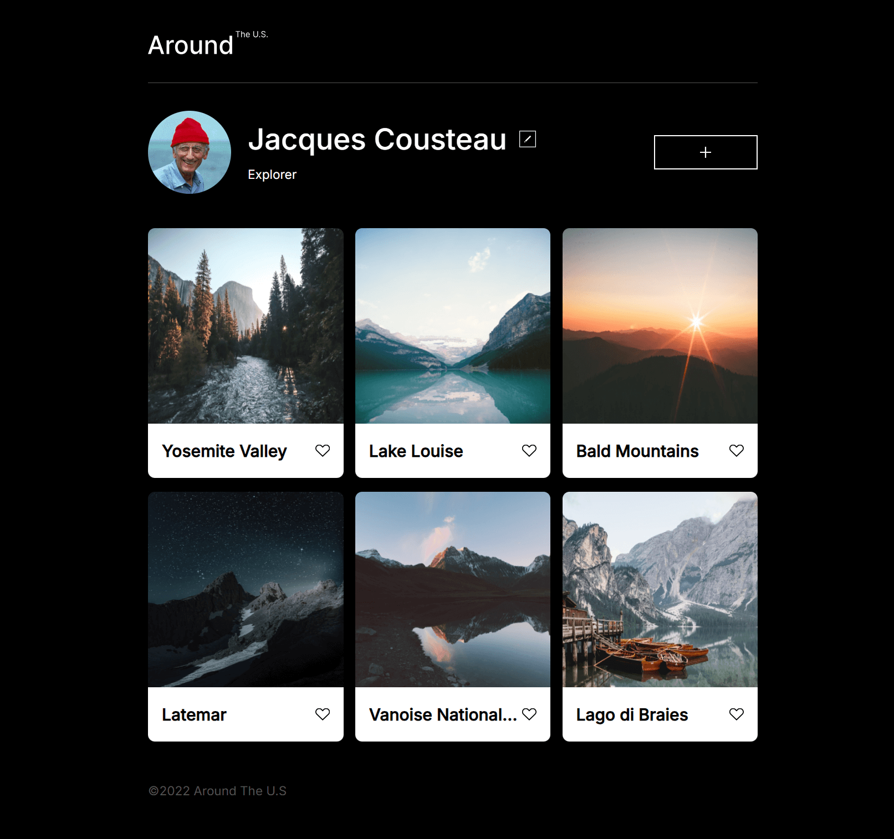

# Project 3: Around The U.S.

Around the us social media is the sprint 3 final project, It is an exciting and rough experience since is the first project starting from scratch, using a Figma brief we build the base for a wonderful social media where you can share your moments with the world.
We have made a responsive platform where you can easily create your personal or business profile and post all the graphic content of your preference.

## Features

WE HAVE CREATED A DEVICE RESPONSIVE USING

- MEDIA QUERIES FOR MOBILE VERSION.

* HTLM.
* CCS.
* FIGMA.
* FLEXBOX/GRID.
* POSITIONING.

## FUTURE IMPROVEMENTS

- DIRECT MESSAGE/VOICE CHAT
- LIVE STREAM

## WEBSITE

[LINK] (https://lausonsiyo.github.io/se_project_aroundtheus/)

## Preview

## DEMO VIDEO

https://drive.google.com/file/d/1i-_9KcKggSv9eQWtcrfFsUTqE-Z3c-FP/view?usp=drive_link
